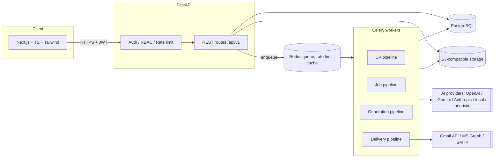

# 02 — Architecture

## 1. System diagram



## 2. Pipeline (spec §17/§19)

```
User → Auth → Candidate Profile ← CV Parser ← Upload
Job Intake → Job Parser → (Company Research) → Matching Engine
→ CV Tailoring → Cover Letter → Email Agent → Quality Control
→ Human Review → Approval → Delivery → Tracker
```

Each box is a separate module under `backend/app/services/` with typed inputs/outputs. No giant prompt.

## 3. Backend layout

```
backend/app
├── main.py                  app factory, middleware, routers
├── core/                    config, db, security (argon2/JWT), crypto (Fernet), ratelimit, logging, deps
├── models/                  SQLAlchemy 2.0 models (one file per aggregate)
├── schemas/                 Pydantic request/response + LLM output schemas
├── api/routes/              auth, profile, resumes, jobs, matches, applications, email, analytics, settings, privacy, admin
└── services/
    ├── ai/                  provider interface, adapters, router (model tiers), cache, agents, prompt-safety
    ├── parsing/             documents (pdf/docx/ocr), cv_parser, job_parser, deadlines, url_fetch (SSRF-safe)
    ├── matching/            engine (dimensions, weights, thresholds, explanation)
    ├── dedupe.py            duplicate detection
    ├── generation/          cv_builder, exporters (pdf/docx/tex), cover_letter, email_gen
    ├── qc.py                quality control checks
    ├── delivery/            base, smtp, gmail, outlook, orchestrator (confirmation tokens, caps)
    ├── storage.py           local + S3, signed URLs
    ├── usage.py             quotas / plan limits
    └── audit.py             audit logging
```

## 4. Request lifecycle & states

Long operations (CV parse, job parse, match, generate) are **tasks** with the states
`queued → processing → completed | failed | requires_review`. Each row carries `status`, `status_reason`, and timestamps so the UI never has a silent failure. Celery executes them in production; with `TASK_MODE=inline` (dev/tests) they run synchronously in-process through the same code path.

Application status pipeline (spec §12):

```
saved → analyzing → matched → cv_generated → awaiting_review → approved → sent
      → application_confirmed → interview → offer | rejected | withdrawn
```
`QC blocked` is a flag on `awaiting_review` (cannot be approved until fixed + re-checked).

## 5. Multi-tenancy

Row-level tenancy: every owned table has `user_id` (indexed, FK, `ON DELETE CASCADE`). All access goes through `deps.get_owned()` / queries that always include `user_id == current_user.id`. Object-storage keys are prefixed `u/{user_id}/…` and download URLs are HMAC-signed, short-lived, and user-bound. Optional hardening: Postgres RLS policies (documented in `docs/SECURITY.md`).

## 6. Key design decisions

1. **Profile-grounded generation.** The tailored CV is assembled from `CandidateProfile` entities by ID. The LLM (when configured) returns *selections and rewordings keyed by entity ID*; the builder refuses anything not traceable to the profile.
2. **Heuristic fallback.** A rule-based provider implements the same interface so the product, tests and CI run without network or keys.
3. **Confirmation token.** `POST /applications/send/preview` returns recipients/subjects/attachments + a signed token over `(user, application ids, content hashes)`. `POST /applications/send` requires it, so editing after preview invalidates it.
4. **Provider-agnostic delivery.** `DeliveryChannel` interface (`email.gmail`, `email.outlook`, `email.smtp`, `url.assisted`), registered by name.
5. **Configuration over constants.** Weights, thresholds, plan limits, send caps live in settings tables / env, not code.
